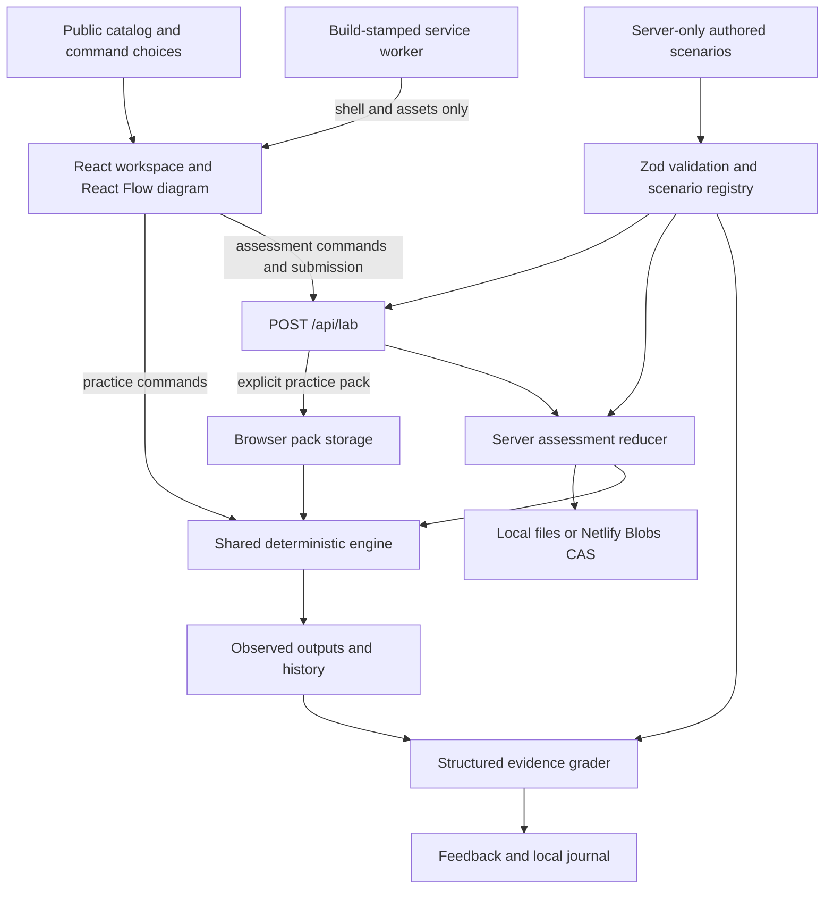

# Milestone 2E — engine audit and multi-lab readiness

> Historical 2E record. Milestone 3A now implements D1–D3 and LAB 006/007; see [execution record](milestone-3a.md). Original findings/probe assertions below intentionally describe the pre-fix state and must not be treated as current passing expectations.

Audit date: 2026-09-21. Repository baseline: `ed95191`, initially clean. Scope is inspection, verification and local planning only. No application code, permanent tests, dependency, infrastructure or lab changes were made. LAB 006–008 are proposals, not implemented content.

## Decision

NetFault can support a small batch of related labs without replacing its engine. It is **not yet a general scenario-authoring platform**, and three arbitrary new packs cannot simply be dropped into it. The strongest reuse is timer compatibility and a wrong **existing, directly linked router** static next hop. Incorrect host masks require a narrowly scoped validation change and an explicit proxy-ARP assumption.

Recommended next authorization: fix the small confirmed issues below, then implement **LAB 006 timer mismatch and LAB 007 incorrect static next hop** as one milestone. Keep the proposed **LAB 008 incorrect subnet mask** for the following milestone unless its extra acceptance gate is explicitly included. If three labs in one batch are a firm preference, a missing OSPF LAN advertisement is a lower-risk third candidate; replacing LAB 008's topic needs user approval. Do not implement either selection during this audit.

The [next-milestone plan](multi-lab-plan.md) specifies files, state contracts, grading, validation gates, order and stop conditions. There is no reason to build DHCP, ACL or trunking engines for these proposals.

## Independent baseline

| Command/check                                     | Current result                                                                    |
| ------------------------------------------------- | --------------------------------------------------------------------------------- |
| `pnpm lint`                                       | Passed                                                                            |
| `pnpm typecheck`                                  | Passed                                                                            |
| `pnpm test`                                       | 200 passed, 9 files                                                               |
| `pnpm build`                                      | Passed; worker build `uM6-npiBSdd7FFv6shuiq`; `/api/lab` remains dynamic          |
| `CI=true`, `PW_PRODUCTION=1`, `pnpm test:browser` | 48 passed, no failures/skips; 24 desktop and 24 at 414 × 896                      |
| Disposable audit probes                           | 8 passed as observations of current behavior, separately from the 200 regressions |

Fresh production-server tests cover all five labs, practice and timed assessment, evidence, repair previews, saved journals, cached offline practice and the existing worker-update flow. The prior local preview was identified before stopping it; it was restored afterward. Development browser tests were not rerun in this documentation-only audit; their old counts are not new evidence. No physical iPhone, Safari/WebKit, IOS/CML/GNS3, hosted Netlify or real cloud deployment validation was performed.

## Actual architecture

- **State and dispatch:** `src/lib/schema.ts` defines interface configuration, devices, physical attachments, optional access switching/static routes, commands, faults, repairs and rubrics. Tables and connectivity are derived, not independently authored. `src/server/scenarios.ts` imports all five packs eagerly and chooses one using an ID conditional with a final passive-lab fallback. IDs and versions are closed enums; every pack revision is currently 1.
- **Forwarding:** `src/lib/engine.ts:28` traverses links and active same-VLAN access ports to discover reachable IP peers. `neighbors` at line 60 filters compatible active point-to-point OSPF endpoints. `routes` at 92 installs C/L, on-link S, then per-area Dijkstra-derived O routes. `lookup` at 137 selects the longest prefix. `forward` at 147 uses a PC's first interface and mask/gateway, or a router's lookup; it resolves an exact next-hop address, detects revisited routers and caps paths at 16 iterations. `connectivity` at 174 calculates request and return independently, including a router's optional source.
- **Observations:** `execute` at 299 renders condensed commands from these functions. `arpState` at 234 replays recorded valid probes against the immutable state to derive successful entries and failed resolution observations. It is not an Ethernet packet/ARP timing simulator. `repaired` at 501 clones and changes one authored area, gateway, VLAN, static-route entry or passive flag. Previews invoke the same engine; React does not recalculate routes.
- **Teaching and grading:** private scenario modules hold faults, evidence requirements, fixes, hints and lessons. `src/lib/grading.ts:2` selects recorded evidence IDs and checks device/command combinations; branches are keyed by repair shape, **not by scenario ID**. Feedback wording and form configuration remain specific to current fault families. Free text is stored, not understood or graded.
- **Practice:** `src/components/netfault.tsx:234` uses an in-memory/cached pack before downloading one. Practice commands, hints, grading and repair run locally. The public diagram is built from catalog device order and subnet labels, not the private scenario's link list.
- **Assessment:** `src/app/api/lab/route.ts` validates bounded JSON, compares browser Origin/Host, and returns no-store at three caching layers. It accepts start/command/resume/submit and explicitly requested practice-pack actions. `src/server/sessions.ts` owns history, 20-minute deadlines and immutable finalization. `session-store.ts` uses local JSON plus a single-process queue locally, or site-scoped Blobs strong reads and ETag conditional writes remotely. Grading ignores client-supplied history; finalized results cannot be revised through later commands.
- **Persistence/PWA:** `src/lib/storage.ts` validates version-1 journals and keeps 100 attempts, preserving corrupt data on errors. Five practice keys coexist. `scripts/service-worker.js` caches a complete build-specific shell/assets snapshot and excludes API/RSC. `src/components/pwa-update.tsx` registers only in production secure contexts and offers controlled activation. Internet remains required for assessment; practice answers are deliberately inspectable.

## Capability matrix

“IMPLEMENTED AND TESTED” means the stated **bounded mechanism**, not full IOS or protocol compliance. “PARTIALLY IMPLEMENTED” identifies a working subset with important exclusions. “UNVERIFIED” denotes a specific claim with no exercised evidence, not an assumed failure. Test names below refer to the retained suite unless marked A1–A8; those probes are preserved in [reproduction notes](engine-audit-probes.md).

| Mechanism                        | Classification         | Source, scope and evidence                                                                                                                                                                                                                                                                                                         |
| -------------------------------- | ---------------------- | ---------------------------------------------------------------------------------------------------------------------------------------------------------------------------------------------------------------------------------------------------------------------------------------------------------------------------------- |
| IPv4 addressing and subnet masks | PARTIALLY IMPLEMENTED  | `schema.ts:3,28,359` validates canonical dotted IPv4 and interface prefixes /1–/30; static destinations permit /0–/32. /31 or /32 interfaces, IPv6 and authored wrong-mask exceptions are absent. `engine.test.ts` addressing/boundary/rejection tests; A4 proves current mask-fault rejection.                                    |
| Local subnet determination       | IMPLEMENTED AND TESTED | `sameSubnet`, `forward` compare the host's mask before selecting next hop. Gateway local/remote tests, plus A4 raw /16 counterexample. Single-interface PC scope.                                                                                                                                                                  |
| Default gateway forwarding       | IMPLEMENTED AND TESTED | `forward` selects the configured gateway for a remote PC destination; `gateway.test.ts` covers absent authored gateway, local success, remote failure and repair. General off-link/missing-gateway configuration is intentionally rejected.                                                                                        |
| Connected/local routes           | IMPLEMENTED AND TESTED | `routes` derives C subnet and L /32 from up interfaces; `engine.test.ts`, `return.test.ts` assert exact tables and precedence. `up` is one combined snapshot, not independent carrier/admin state.                                                                                                                                 |
| Static routes                    | PARTIALLY IMPLEMENTED  | `validateRoute`, `routes`, `repaired` support canonical prefixes, on-link directly attached router next hops, fixed AD 1 and replacement by prefix. `return.test.ts` covers duplicates, invalid hops, down interfaces and repair; A5 covers wrong existing-peer loop. No recursion, tracked/floating routes or switched next hops. |
| Longest-prefix matching          | IMPLEMENTED AND TESTED | `lookup`; `return.test.ts:123` compares /32, /24 and /0 and proves a changed path/loop, not just displayed order.                                                                                                                                                                                                                  |
| Next-hop resolution              | PARTIALLY IMPLEMENTED  | `peers` plus `forward` find the exact reachable peer IP through allowed access ports. Gateway/VLAN failure and repair tests. No proxy ARP, ARP packet exchange/retries or recursive static resolution.                                                                                                                             |
| Forward and return paths         | IMPLEMENTED AND TESTED | `forward`, `connectivity`, trace return checks; original OSPF asymmetry, return-path source selection, inaccessible error replies and all-address repaired matrices. Bounded IP reachability, no packet TTL timing.                                                                                                                |
| VLAN access-port membership      | IMPLEMENTED AND TESTED | Validated ports/VLANs plus `peers`; `vlan.test.ts` changes either membership and active state and adds an unrelated local peer to prove isolation is derived.                                                                                                                                                                      |
| VLAN-aware Layer 2 reachability  | PARTIALLY IMPLEMENTED  | Single-switch access paths tested in gateway/VLAN suites. Access-switch traversal exists; multi-switch cycles, scale and topology combinations remain UNVERIFIED. No STP, trunks, SVI or MAC forwarding database.                                                                                                                  |
| ARP observations                 | PARTIALLY IMPLEMENTED  | `arpState`; VLAN tests cover initially empty, failed gateway resolution, learned peer MAC, preserved history and fresh repaired sequence. Return tests reject invalid source replay. No aging, unsolicited/gratuitous ARP, proxy responses or packet-driven cache.                                                                 |
| OSPF neighbor formation          | PARTIALLY IMPLEMENTED  | `neighbors` derives reciprocal established FULL/- on explicit point-to-point interfaces. Engine/passive tests cover physical/passive/type/MTU/enabled guards. No transient FSM, elections, retransmissions or LSDB exchange.                                                                                                       |
| OSPF area compatibility          | PARTIALLY IMPLEMENTED  | Area equality blocks the original broken adjacency; repair restores it. `engine.test.ts`, `passive.test.ts`. No ABR summaries or inter-area routing; area IDs do not imply those features.                                                                                                                                         |
| OSPF passive-interface behavior  | IMPLEMENTED AND TESTED | `neighbors` suppresses adjacency; `routes` still advertises up enabled prefixes via other neighbors. `passive.test.ts:106–178` and exact-boolean repair tests. Passive LANs retain advertisements.                                                                                                                                 |
| OSPF Hello/Dead compatibility    | PARTIALLY IMPLEMENTED  | Equality checks exercised independently in `passive.test.ts:167`. No countdown or fast-Hello mode; A1 confirms incorrect fixed neighbor timer display for valid shorter timers.                                                                                                                                                    |
| OSPF route advertisement         | PARTIALLY IMPLEMENTED  | `routes` derives reachable-area interface prefixes, including passive/disconnected transit advertisements. Engine/passive tests cover enabled/up/area effects. No actual LSA origination, aging or flooding.                                                                                                                       |
| OSPF route derivation            | PARTIALLY IMPLEMENTED  | Dijkstra by area plus C/S preference; exact broken/repaired costs and reachability matrices pass. No external/inter-area route types, redistribution or ECMP.                                                                                                                                                                      |
| OSPF cost-based selection        | PARTIALLY IMPLEMENTED  | Existing tests verify chain metrics 2/3. A6 additionally verifies a triangle chooses direct cost 2 then indirect cost 12 when a link costs 50. Equal-cost policy, broader weighted graphs and cross-area preferences remain unverified/unsupported.                                                                                |
| ACL filtering                    | NOT IMPLEMENTED        | No ACL state or filtering stage in schema/forwarding, no command registry support. No positive tests. UI/incident references to ACL absence do not implement ACLs.                                                                                                                                                                 |
| DHCP                             | NOT IMPLEMENTED        | Static addresses only; `ipconfig /all` reports DHCP disabled. No leases/server/state machine or positive DHCP tests.                                                                                                                                                                                                               |
| Trunking                         | NOT IMPLEMENTED        | Access ports only; trunk command absent from `commandNames`. No tagging/native/allowed VLAN model or positive trunk tests.                                                                                                                                                                                                         |

## Confirmed defects and validation gaps

### D1 — repair-specific clue is shipped in the initial client bundle (priority 1)

`src/components/netfault.tsx:1170` embeds “AFTER REPAIR — only R2's static routing configuration changes”. Although the preview is shown after submission, the handler text is bundled before submission and identifies LAB 004's affected device/configuration family. A fresh production asset fetch confirmed the phrase in `/_next/static/chunks/2y506hv4gjh8b.js` without starting practice. Existing `tests/browser/return.spec.ts` checks selected private command/lesson phrases but omits this phrase, so its passing result does **not** prove complete answer absence.

This is a partial answer clue, not an assessment write bypass or exposure of a full private pack through assessment start. Practice-pack availability is a separate disclosed self-assessment limitation. Required next fix: remove location-specific preview narration from client source, preferably return private preview recipes with finalized feedback/practice data; add a fresh-client static-asset regression for all repair-specific prose. Preserve public multiple-choice options and design intent.

### D2 — an empty evidence rule earns points with no evidence (priority 1 authoring guard)

`schema.ts:162` allows `requirements: []`; the later validation loops have no elements to reject. `grading.ts:8` uses `every`, which is true for an empty list. Probe A2 replaces LAB 005's rubric with one empty 30-point rule: schema accepts it and otherwise correct selections score 100 with no history. Existing five packs have nonempty rules and do not exhibit this problem. Clients cannot submit new rubrics to the assessment API.

Required next fix: nonempty evidence rules and requirement lists, retaining nonempty device/command alternatives and total 30. Add schema and grader-boundary tests. Treat this as protection against bad authored packs, not a reason to redesign server assessment.

### D3 — fixed dead-time output contradicts supported shorter timers (priority 2; before LAB 006)

`engine.ts:441` always prints `00:00:36`. A1 sets a healthy validated model to Hello 5/Dead 20. Interface output correctly shows 5/20, neighbors remain FULL, but their displayed remaining dead time exceeds the configured interval. Existing authored labs all use 10/40, so their representative snapshot is unaffected.

Required next fix: omit the countdown or clearly render a bounded representative value derived from the configured dead interval. Do not introduce live timers solely for this display. Test matching 5/20, original 10/40 and mismatched endpoints against the same state.

### Confirmed authoring gaps, not failures of current playable labs

- **A3:** `fault.interface` is free text and a nonexistent `R99:Missing` is accepted. Device references are checked; interface metadata is not. Add explicit target validation where required by the fault family.
- **A7:** changing the passive pack ID to `ospf-01` still validates. `catalog`, server registry and schema do not enforce a shared ID/content contract. Add a registry-level contract rather than hardcoding all future physics in Zod.
- **A8:** a valid passive repair can point to an already active interface; schema accepts it, the repair is a no-op and connectivity stays broken. Structural validity is not semantic solvability. Add a shared authored-case validator asserting expected broken symptoms, exact allowed changes and repaired outcomes.
- OSPF timers/MTU/cost are positive numbers with limited platform-range validation; MACs and some metadata are free strings. Do not use unconstrained random values. Range/type constraints should match the specific supported profile, not imply all IOS configurations work.

No contradictory route or connectivity result was found for the five shipped states and their tested repairs. No duplicated route algorithm exists in React. Fix the demonstrated boundary issues; an engine rewrite is unjustified.

## Architectural risks and expansion limits

| Risk                                        | Evidence and consequence                                                                                                                                                                                                                                               | Required response / timing                                                                                                                                                                                                                            |
| ------------------------------------------- | ---------------------------------------------------------------------------------------------------------------------------------------------------------------------------------------------------------------------------------------------------------------------- | ----------------------------------------------------------------------------------------------------------------------------------------------------------------------------------------------------------------------------------------------------- |
| Fixed five-node chain diagram               | `topology.tsx:45–85` has five positions and edges between consecutive catalog devices. A sixth device indexes a missing position; a triangle/branch is drawn incorrectly even if the engine can calculate it. `vlan.test.ts` already validates a sixth engine-only PC. | Keep the next batch to existing five-node chains. Before topology variations, supply public explicit edges and a bounded layout independent of private fault metadata.                                                                                |
| Identity and form coupling                  | API device enum is PC-A/R1/R2/R3/SW1/PC-B; client resets to PC-A. Two switchport names are literal command enum entries. Forms, hint counts and previews switch on lab IDs.                                                                                            | Small public per-lab UI descriptors and explicit server registry; validate requested bounded device strings against the stored scenario. Parameterize port commands only when renamed-port content is authorized.                                     |
| Revision drift across deployments           | Pack `revision` is literal 1; attempts contain scenario ID but no revision/instance. `sessions.ts:36` loads current registry state on every invocation; `getPack` indefinitely prefers cached same-ID content.                                                         | New IDs alone are safe if old content is frozen. Before modifying existing content or randomizing, persist immutable scenario revision/instance identity; keep the resolver/old packs and define explicit new-pack refresh. No Blobs redesign needed. |
| Rollback/forward compatibility              | Entire journal is parsed as one array; an unknown scenario/version prevents loading it. Errors preserve bytes, but old code cannot display newer records.                                                                                                              | Keep raw export, test upgrade/rollback fixtures and consider per-record recovery before scale. Never silently delete unrecognized attempts.                                                                                                           |
| Cache shell does not refresh packs          | Worker updates assets, but localStorage pack key has no revision and `getPack` does not refresh it.                                                                                                                                                                    | Separate shell update from content revision policy; test old active attempts and new practice starts independently. Not a current five-pack offline failure.                                                                                          |
| Grading family wording                      | Static-route branch says missing route/reply explanation; area repair uses an encoded option ID. Other repair branches vary in how device correctness gates repair points.                                                                                             | Add explicit new rubric policy/wording without changing existing totals. Wrong-next-hop should not inherit missing-return-route explanations.                                                                                                         |
| Simplified physical state and routing scale | One `up` boolean, 16-hop cap, repeated route derivation; no independent carrier model, performance benchmark or multi-process local filesystem safety.                                                                                                                 | Keep authored snapshots/small networks. Do not market arbitrary interface-down labs, large topologies or concurrent local servers without separate validation.                                                                                        |
| Scenario import coupling                    | Registry eagerly imports all packs; one parse failure can break all API actions. Final ternary fallback hides a forgotten registry branch if the ID union is expanded.                                                                                                 | Exhaustive typed registry and all-pack startup/contract test; do not replace errors with a default lab.                                                                                                                                               |

Optional improvements: extract duplicated test observation builders, preview command recipes and public form metadata incrementally as the next two labs use them. Do not build a visual authoring tool, generic plugin system, event-driven IOS emulator or authentication platform to add these labs.

## Randomized scenario feasibility

| Variation                           | Existing support                                                                                 | Additional requirements before use                                                                                                                                                     |
| ----------------------------------- | ------------------------------------------------------------------------------------------------ | -------------------------------------------------------------------------------------------------------------------------------------------------------------------------------------- |
| Different affected router/interface | Engine fields/repair references can express several targets                                      | Regenerate evidence rules, correct-answer targets, hints, lessons, preview recipes and public form options together. Test the single-fault delta and observability.                    |
| Different device/interface names    | Core names are strings                                                                           | Remove fixed API names, PC-A resets, switchport enum literals and diagnosis/preview assumptions. Use an injective rename mapping across all references.                                |
| Different IPs                       | Numeric subnet helpers and commands derive outputs                                               | Allocate disjoint valid subnets/unique host and router IDs; regenerate gateways, static next hops, labels, intended design and learning text. Do not string-replace partial addresses. |
| Different fault locations           | Many existing flags can move                                                                     | Verify exact adjacency/route components and both traffic directions; preserve correct passive LANs and no alternate masking path.                                                      |
| Different topology                  | Schema links and core traversal allow more than chains; A6 proves one triangle route calculation | Public edge/layout model, stricter supported-topology validation, scale and multi-switch tests. Current UI cannot represent it reliably.                                               |
| Different valid repairs             | `acceptedFixes` can name several choices, but preview has one canonical patch                    | Normalize an accepted structured repair set, enforce design intent, apply/test the chosen patch and explain alternatives; connectivity alone is insufficient.                          |

Feasible later: deterministic finite variants generated from a **validated healthy template**, one typed fault injection and a known inverse patch. Each variant must pass schema, graph/address contracts, independently specified failed/successful probes, route/neighbor expectations, evidence sufficiency and exact repaired-delta checks before exposure. Record template revision, generator version, seed and immutable server-side instance identity (or retain the full generated snapshot server-side); a seed alone is insufficient across generator updates. Never expose the seed plus a public answer-generating template as secure assessment content. Keep the existing storage provider; extend its record only if/when variants are authorized.

Do not randomize now. Start with a small enumerated, reviewed set of variants, not arbitrary graph/value generation. Shuffle investigation or option order separately from changing networking truth.

## Testing strategy and allowance efficiency

The retained suite provides meaningful behavioral evidence: broken/repaired all-address matrices, same-VLAN counterexamples, asymmetric return paths, source-sensitive pings, forged evidence rejection, separate server module invocations, SDK conditional-write contracts and real production worker offline flows. It is stronger than a snapshot-only suite. However, some command tests merely require stable output/no “Unsupported”; privacy scans check a few strings, and most route tests are single-path unit-cost chains. Passing counts are not a general certification.

Prioritize reusable **case contracts**, not a test-suite rewrite: catalog/schema/command agreement; exact allowed fault/repair delta; independently enumerated route/neighbor/probe expectations; minimum evidence and no-evidence/incorrect-answer scores; revision/save fixtures; complete desktop/mobile practice/assessment/offline flows. Extend privacy scans with D1 and move private preview recipes server-side so tests enforce a boundary rather than an ever-growing list of guessed phrases. Retain all current regression assertions. Add only the weighted-path, timer, authoring and lifecycle cases needed by new scope.

| Approach                  | Recommendation                                                                                                                                                    |
| ------------------------- | ----------------------------------------------------------------------------------------------------------------------------------------------------------------- |
| One lab at a time         | Best when a new mechanism or validation boundary is involved; appropriate for the first incorrect-mask lab.                                                       |
| Two related labs          | Best immediate balance: shared guard fixes/integration once, then timer and on-link static-hop content separately verified.                                       |
| Three related labs        | Feasible after explicit gates; missing advertisement is a better third reuse candidate than masks. Do not sacrifice repair/evidence/mobile checks to hit a count. |
| Larger batches            | Defer until metadata/registry/test contracts reduce manual branching and at least one small batch has succeeded.                                                  |
| Reusable authoring system | Implement only small typed metadata, shared fixtures and validators encountered during the batch; no separate editor/framework.                                   |
| Validated variations      | Later, after immutable revision/instance support and removal of identity/topology assumptions.                                                                    |

Use this audit as the handoff: verify commit drift, reproduce only touched findings, write targeted tests first, complete each lab before the next, then run one combined full regression/build/browser matrix. Rerun broad checks only after meaningful code changes or failures. Do not use/reset credits automatically; no allowance consumption estimate or exact time saving is claimed.

## References checked in this audit

- [Cisco OSPF configuration guide](https://www.cisco.com/c/en/us/td/docs/switches/lan/c9000/lyr3-fwd/ospf/ospf-configuration-guide/ospf.html): compatible Hello/Dead settings and passive-interface behavior. This supports the bounded model, not a full IOS emulation claim.
- [RFC 1122, local/remote routing decision](https://www.rfc-editor.org/rfc/rfc1122#section-3.3.1.1): a host's subnet mask informs whether to send directly or through a gateway.
- [Cisco: Understand Proxy ARP](https://www.cisco.com/c/en/us/support/docs/ip/dynamic-address-allocation-resolution/13718-5.html): a router can answer ARP for an off-link destination and thereby make an oversized host mask appear functional. Defaults vary by platform/release; the proposed lab must explicitly define proxy ARP as disabled and show that configuration. NetFault currently does not model proxy ARP.

These were read-only reference checks. No new release was deployed or compared to real router captures. Known defects above remain deliberately unfixed under the audit-only scope.
