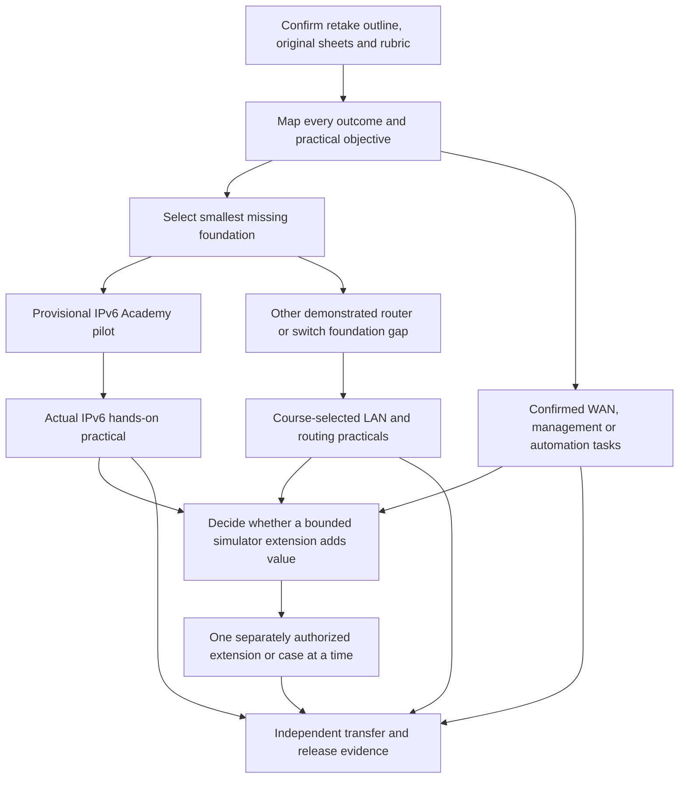

# NetFault completion roadmap — proposals, not implementation

**Provisional.** Current retake materials and practical priorities are missing. [H24](wia2008-sources.md) supports broad historical outcomes only; the [coverage matrix](wia2008-coverage.md) records exact locations. No target lab/module count is a completion criterion. Preserve the learner-accepted 3C design, tap flow and existing seven cases.

## Ordering decision

**Immediate next step: evidence intake and current-semester mapping, not LAB 008.** The next implementation topic cannot be definitively prioritized until the outline, originals and assessment brief are inspected. If a provisional implementation recommendation is useful, choose **one IPv6 address/prefix foundations Academy pilot**, subject to that gate and separate authorization. H24 O3 explicitly includes IPv6, whereas the app is entirely IPv4. This is stronger historical evidence for a missing foundation than simply adding another similar OSPF fault. It is still an editorial recommendation, not proof of current urgency.

The learner has not demonstrated a particular misconception in this task. Do not infer weakness from a retake or from app progress counts. Current assessment deadlines and actual diagnostic feedback may reorder proposals. The [next-milestone brief](wia2008-next-milestone.md) defines the bounded candidate and stop conditions.

This is a dependency graph, not a commitment to build every branch. A theory objective can finish through explanation and independent reasoning; practical competence retains external configuration evidence.

## Bounded milestone candidates

Each acceptance task below is **proposed**. Its passing thresholds and grading must be reviewed against actual course instructions before use. Source pointers state the strongest available evidence, not invented chapter numbers.

| Proposal / objective | Course evidence and proposed learning work | Engine / scenarios | Dependencies, risk and independent acceptance |
| --- | --- | --- | --- |
| **E0 — Current-semester evidence closure** | Obtain materials listed in source inventory. Preserve original topic/sheet IDs; map each CLO/practical task to learning, simulator and hands-on evidence. H24 p.45–46 establishes only the historical starting point | None; documentation only | First gate. Risk: outdated or incomplete notes masquerading as originals. Accept when every supplied requirement has a readable exact source location, semester, intended activity and explicit gap; unknowns remain flagged |
| **F1 — One IPv6 address/prefix pilot** *(provisional NEXT implementation)* | H24 O3, printed p.45/PDF p.59 item 3. One seven-part lesson; notation/prefix diagrams; guided and different independent tap reasoning. Exact course examples confirmed in E0 | No new network simulation or lab; reuse public Academy framework. See separate scope | After E0 confirms IPv6 remains required and no more urgent source-backed gap. Risk: applying IPv4 host/broadcast rules or trivial recognition. Accept when learner can distinguish equivalent addresses and prefix membership on unseen paper/tap examples, explaining reasoning before reveal |
| **P1 — One actual IPv6 practical companion** | H24 O3 plus **required missing original IPv6 sheet identifier/pages**. Map its build/configure/verify steps to concise preparation, a topology/next-hop diagram and observation predictions | Default is Packet Tracer/real device practice. No invented NetFault lab. Consider bounded engine work only after identifying a repeated diagnostic learning gap | Depends F1 and actual equipment/tool instructions. Risk: link-local/ND/address-selection behavior unsupported by app. Accept with learner's saved topology/config and required bidirectional verification, followed by an unfamiliar fault diagnosis without the worked solution |
| **L1 — One LAN mechanism at a time** | H24 STP synopsis p.46; EtherChannel is only U3D Chapter 2 lead until inspected. Select STP **or** EtherChannel first from the actual sequence/practical. Use one meaningful topology/state diagram and guided/independent prediction pair | Prefer authentic operational output and hands-on configuration. Any STP/aggregation engine is a separate milestone with [feasibility gate](wia2008-engine-feasibility.md#conditional-new-topic-feasibility--proposals-only) | Depends actual sheet and demonstrated Ethernet prerequisites, not an automatic full Ethernet module. Risks: election/negotiation variant and assuming links are all forwarding. Accept when learner predicts state and explains observed failure/recovery on a changed topology |
| **R1 — OSPF mechanism-to-configuration bridge** | H24 OSPF synopsis p.46; obtain Chapter 5 and original practical before selecting missing subtopic. Reuse existing case evidence; propose a narrow adjacency-to-route reasoning lesson or one required configuration exercise, not the whole protocol at once | Reuse LAB 001/005/006 for current supported scope. Broadcast/database/multiarea work goes to real/PT or a separately specified extension; no extra OSPF lab by default | Depends source tasks, IPv4/route interpretation and any required L2 concepts. Risk: treating FULL as whole-protocol understanding. Accept when learner builds/verifies required OSPF topology and discriminates faults from evidence, including an unfamiliar configuration |
| **R2 — EIGRP companion, only if current** | H24 EIGRP synopsis p.46; missing current chapter and practical determine version/mode/objectives. One bounded conceptual/route-reading slice followed by the specified hands-on task | No present support. No full DUAL stack commitment; authentic tool work is default | Depends routing foundations and E0 confirmation. Risk: stale syllabus and misleading OSPF substitution. Accept against exact course task using authentic neighbor/route observations and independent troubleshooting |
| **W1 — One WAN technology practical at a time** | H24 PPP/VPN synopsis p.46; current sheets must identify the actual mechanism. Select one lesson/example, one independent decision task and one actual configuration practical per authorized increment | No existing session/tunnel model. No simulator case until type, state, probes and regression contract are defined | Depends addressing/routing and relevant course security prerequisites. Risk: overly broad “VPN” implementation. Accept when learner distinguishes underlay reachability from the specified link/session/tunnel behavior and verifies recovery in the real tool |
| **M1 — One source-selected management/design/automation objective** | H24 O2 p.45 is broad; U3D Chapters 10/12 are uninspected. Wait for exact tasks. Choose a diagram/log/design constraint/API interpretation exercise where appropriate; retain authentic external tools | Usually Academy/paper/tool work rather than new forwarding engine. No fabricated controller, logs or service simulation | Depends source-specified prerequisites. Risk: adding generic cloud/cybersecurity material unrelated to ANT. Accept via the exact required artifact and a novel independent reasoning task; automation code must actually run in its stated environment |
| **T1 — Independent transfer and completion review** | H24 O1–O3 plus **every confirmed current CLO and original practical** mapped by E0. Build a review matrix and source-aligned mixed reasoning tasks; avoid arbitrary random variations/lab quotas | Existing labs remain useful; at most one newly demonstrated coverage gap per authorized implementation. No automatic randomization engine | After applicable branches. Risk: memorized answers mistaken for capability. Accept when learner completes unseen source-aligned troubleshooting and required build/configure/verify tasks with documented aid level; close or explicitly exclude every remaining requirement |

E0 may remove obsolete H24 topics or add current ones. F1 is not a requirement that all IPv6 work precede every IPv4 lab. Configuration and time-critical coursework may run in parallel with short mobile study. Break any candidate that needs several protocols, a new topology renderer and a new engine into separate approved milestones before implementation.

## What completion depends on

The [release checklist](wia2008-release-checklist.md) is the completion contract. A course objective may be fulfilled through a documented combination of mobile study, bounded simulation and external practical performance. It need not have its own NetFault lab. NetFault remains a companion: formal coursework, equipment skills and exam performance cannot be replaced or guaranteed by an app score.
